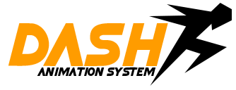

# Dash Animation System
Dash Animation System for Unity is a system that was designed to make animation editing more approachable and user friendly. It offers solution to commonly encountered problems like visual editing and prototyping of programmatic animations called tweens. Combining tween and statically authored timeline animations. Sequencing, altering and retargeting of statically authored animations and much more.

<hr>
<p align="center">	
	<a href="https://twitter.com/sHTiF">
		
	</a>
	<a href="https://trello.com/b/TkNujmEq/dash">
		
	</a>
</p>
<hr>

> #### WARNING THIS IS A BETA RELEASE SO IT IS PRONE TO BEING CHANGED REGULARLY AND THERE IS HIGH PROBABILITY OF SERIALIZATION FAILURE ON ALREADY CREATED ASSETS!

## Prerequisities

* Unity 2019.4 LTS + (It may work on older versions but there are no guarantees and support.)
* NET 4.X API Compatibility Level

## Installation

#### UnityPackage

The old school version of installing stuff within Unity is using the _.unitypackage_ this can be found in releases. Just download the _.unitypackage_ and open it inside Unity.

#### Unity Package Manager (Prefferred)

Using Package Manager is now the prefferred method, all releases should be updated immediately.

Add Scoped Registry into Package manager using Project Settings => Package Manager as below:  
Name:  
```
Dash Registry
```  
URL:  
```
http://package.binaryego.com:4873
```  
Scopes:  
```
com.shtif
com.teamsirenix
```


After this you can find Dash in My Registries inside Package Manager.


## Where to start

There are multiple building blocks in Dash Animation System that either depend on each other or communicate with each other. Lets go over them one by one and how to use them.

### DashEditor

We will refer to DashEditor as a single entity even though it is collection of multiple classes and utilities. Generaly when we are going to talk about editor we are referring to the editor window in Unity where you edit the visual represenation of the Dash graph.

### DashController

DashController is a monobehaviour that connects the system with your project. It wraps a Dash Graph and communicates with it as well as optionally can bind properties with DashGraph. It is also the entry point to the DashGraph execution and its game object is the default target for graph logic execution.

### DashGraph

DashGraph is the center of the animation system it is a single graph containing any number of nodes and connections between them that executes based on events sent to the graph.

There can be **asset** or **bound** graph. The asset graphs are saved as unity asset files that can be later used by any DashController instance as well as shared between projects while bound graphs are bound to a single DashController instance and are serialized within it.

### Variables

Variables are special properties of node graph that can be referenced using parametrization inside node models. At the same time variables can be bound to external Unity properties. Through this combination it gives user the ability to drive node functionality based on external properties.

### Node / NodeModel

Node is a building block of the Dash graph. There are numerous types of nodes separated in multiple categories depending on a common functionality of a particular node. Like Animation, Logic, Events etc. There will be new nodes in the future as the functionality of the framework expands as well as potentially new categories.

Each node can have any number of inputs as well as any number of outputs. The most basic node has one input and one output where the data just flows through it as it executes and continues to the next node. Nodes with 0 inputs are always entry points or events and need to be triggered externally or internally by other node streams rather than directly.

Each node has its own model which holds its properties, nodes themselves are stateless in nature and they just execute on target based on their properties hold by model.

[Nodes Documentation Here](./Documentation/Nodes.md)

### Parametrization

Various properties in many node models are parameters rather than direct values. This means they can either just hold a value or be expression driven. When a property is driven by expression there is no direct value but the value is evaluated based on the expression defined. This can be as simple as a reference to a data attribute or as complex as multiple nested function calls.

[Expression Documentation Here](./Documentation/Expression.md)

### NodeFlowData / Attributes

There is a data flowing through nodes when graph is executing, this data consist of attributes and may get modified by nodes as it passes through them. Each node clones the data when it is forwarding it rather than change being done on a single instance. So for example retargeting happening in a node down the graph will not retarget the data handled before this point in graph.

Attributes are properties on the node flow data instance. There can be reserved and predefined attributes or user defined attributes, it is possible to add attributes to the node flow data in the middle of graph as needed.

## Licensing

For license information read here [LICENSE](LICENSE.md)

## 3rd Party Libraries

List of 3rd Party libraries used in the project

* Odin Serializer (https://github.com/TeamSirenix/odin-serializer)
* NCalc (https://github.com/sklose/NCalc2) 
